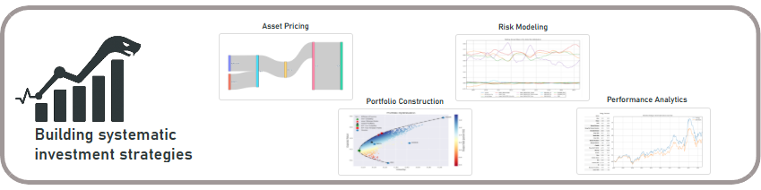

<!-- banner image -->

  

  <!-- Information -->
    
  <!-- Programming Languages -->
  
  
  
  
  <!-- Libraries -->
  
  
  
  
  
  
  
  
  
  <!-- Documentation & Community -->
  

---

## 👨‍💻 About Me

I'm a quantitative researcher for a systematic equity fund covering developed markets. My responsibilities span both
research and development:
- **Research**: improving the investment strategy via in-depth research on asset pricing, risk management, 
portfolio construction and performance analysis.
- **Development**: design, development, implementation and maintenance of the code infrastructure that is required within
the team to effectively perform research.

In addition to my professional experience, I have a strong passion for quantitative finance and programming, which 
extends beyond my day-to-day work. As a result, I have developed my own private code base to support my research
on systematic investment strategies.

- 🔭 **Current Focus**:
  - *Research*: Trade delays & indirect exposure to short-term signals.
  - *Development*: Building the `Quant-Finance` python library.
- 📚 **Recent readings**:
    - The Elements of Quantitative Investing - Paleologo, G. A.
    - Advances in Financial Machine Learning - De Prado, M. L.
- 💼 **Programming & Tools**:  
  - Python, Matlab, Java, R
  - Axioma Portfolio Optimizer
  - Azure DevOps, Git, SQL
  - Dash, Streamlit, Sphinx, LaTex

---

## 🚀 quant-finance  

<!-- banner image -->

  

### 💡 Main Idea

- A private, end-to-end python library powering quant equity research, from signal design and strategy backtesting 
through risk management and performance attribution.

### 🔑 Key Features

- **Alpha Factor Engineering**
  - Design, test and refine robust predictive signals with ease.
  - A fully modular pipeline that allows chaining of both cross-sectional and time-series based transformation.

- **Portfolio Construction**
  - Seamlessly translate factor scores into actual portfolios using flexible rebalancing schemes and customizable settings.
  - Flexible rebalancing schemes, portfolio drift and customizable settings such that your backtests stay grounded in reality.

- **Risk Modeling**  
  - Gain control over your risk through sophisticated risk models, risk parity weighting and hedging.
  - Choose from a variety of covariance estimators and shrinkage methods to suit your universe.

- **Performance Analytics**
  - Quickly iterate on new ideas and compare performance metrics via built-in diagnostics.
  - Automized reports and interactive visuals empower you to communicate your strategy’s story to stakeholders with clarity and impact.
